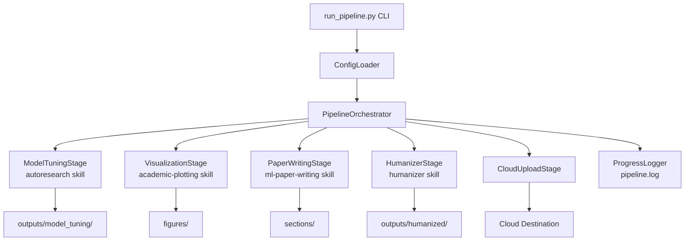
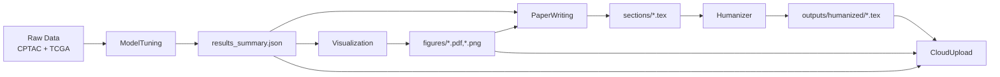
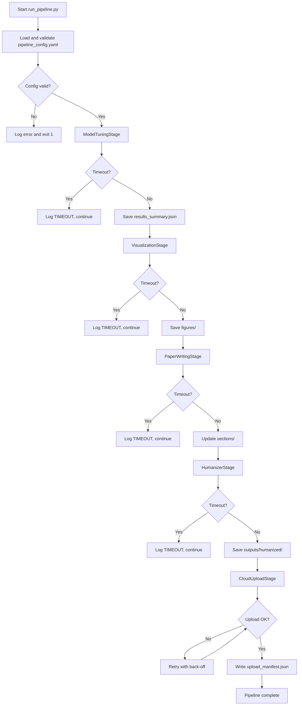
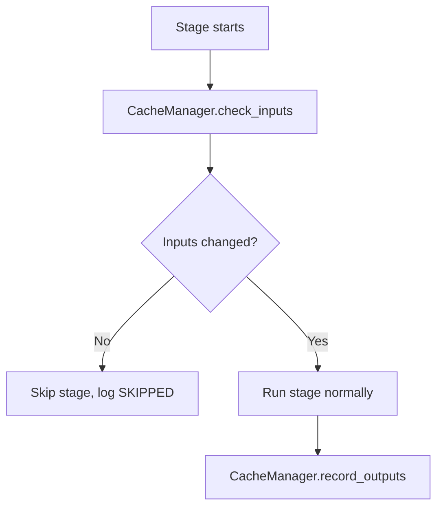

# Design Document

## Overview

The GBM Research Automation Pipeline is a Python-based orchestration system that drives the full workflow from raw data to a submission-ready LaTeX manuscript. Each stage is implemented as a self-contained module with a hard 90-minute wall-clock timeout. The pipeline supports offline execution, incremental caching, and automatic cloud upload.

---

## Architecture

### System Architecture Diagram



### Data Flow Diagram



---

## Components and Interfaces

### `ConfigLoader`
- **Responsibilities:** Load and validate `pipeline_config.yaml`; resolve relative paths; raise descriptive errors for missing keys.
- **Interface:**
  ```python
  class ConfigLoader:
      def __init__(self, config_path: str) -> None: ...
      def get(self, key: str) -> Any: ...
      def validate(self) -> None: ...
  ```

### `PipelineOrchestrator`
- **Responsibilities:** Run stages in order; enforce the 90-minute per-stage timeout; handle caching via `CacheManager`; write structured logs.
- **Interface:**
  ```python
  class PipelineOrchestrator:
      def __init__(self, config: ConfigLoader, force: bool = False) -> None: ...
      def run(self, stages: list[str] | None = None) -> int: ...
  ```

### `BaseStage`
- **Responsibilities:** Abstract base for all pipeline stages; provides `should_skip()` (cache check) and `execute_with_timeout()` helpers.
- **Interface:**
  ```python
  class BaseStage(ABC):
      TIMEOUT_SECONDS: int = 5400  # 90 minutes
      def run(self, config: ConfigLoader, force: bool) -> StageResult: ...
      def should_skip(self, config: ConfigLoader) -> bool: ...
  ```

### `ModelTuningStage`
- **Responsibilities:** Invoke the `autoresearch` skill CLI to run hyperparameter search; persist tuned artifacts and `results_summary.json`.

### `VisualizationStage`
- **Responsibilities:** Invoke the `academic-plotting` skill CLI to regenerate all figures; place outputs in `figures/`.

### `PaperWritingStage`
- **Responsibilities:** Invoke the `ml-paper-writing` skill CLI to update `sections/*.tex`; replace only `% AUTO-GENERATED` blocks.

### `HumanizerStage`
- **Responsibilities:** Invoke the `humanizer` skill CLI on section files; write results to `outputs/humanized/`; produce diff report.

### `CloudUploadStage`
- **Responsibilities:** Upload `outputs/` and `figures/` to the cloud destination; retry on failure with exponential back-off; write `upload_manifest.json`.

### `CacheManager`
- **Responsibilities:** Check and record checksums for input/output files to support incremental skipping.

### `ProgressLogger`
- **Responsibilities:** Write structured JSON log lines to `pipeline.log` with stage name, status, elapsed time, and timestamp.

---

## Data Models

```python
from dataclasses import dataclass, field
from enum import Enum
from typing import Optional

class StageStatus(Enum):
    PENDING = "pending"
    RUNNING = "running"
    COMPLETED = "completed"
    TIMEOUT = "timeout"
    FAILED = "failed"
    SKIPPED = "skipped"

@dataclass
class StageResult:
    stage: str
    status: StageStatus
    elapsed_seconds: float
    message: str = ""
    artifacts: list[str] = field(default_factory=list)

@dataclass
class PipelineConfig:
    data_paths: dict[str, str]
    outputs_dir: str
    figures_dir: str
    sections_dir: str
    timeout_seconds: int
    force: bool
    cloud: dict[str, str]
    skills: dict[str, str]
```

---

## Business Process

### Process 1: Full Pipeline Run



### Process 2: Cache-Hit Skip



---

## Error Handling Strategy

| Scenario | Handling |
|---|---|
| Config key missing | Raise `ConfigError` with key name; exit before any stage |
| Stage timeout | Log `TIMEOUT`; mark `StageResult.status = TIMEOUT`; proceed to next stage |
| Stage exception | Log full traceback; mark `StageResult.status = FAILED`; proceed |
| Cloud offline | Retry with exponential back-off (1 min, 2 min, 4 min, 8 min, 10 min cap) |
| Humanizer returns empty | Log warning; retain original `sections/` file |
| Disk full | Raise `DiskError`; abort pipeline |

---

## Testing Strategy

- Unit tests for `ConfigLoader.validate()` covering missing/extra keys
- Unit tests for `CacheManager` checksum logic
- Integration smoke test: mock each skill CLI with a fast stub; run full pipeline; assert all `StageResult.status` values are `COMPLETED`
- Timeout test: inject a stub that sleeps 5 400 s; assert stage is killed within `TIMEOUT_SECONDS + 5`
