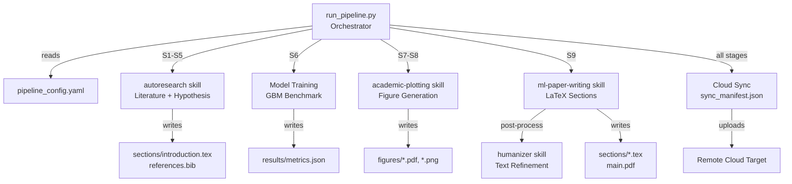
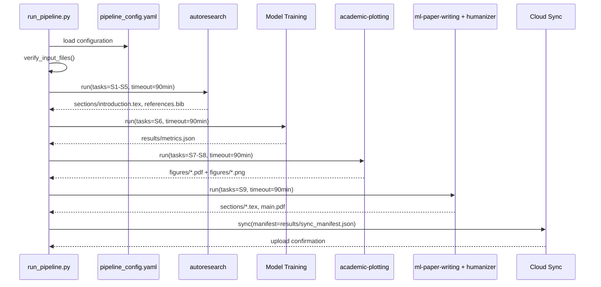
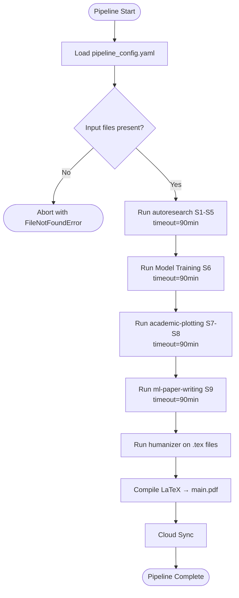
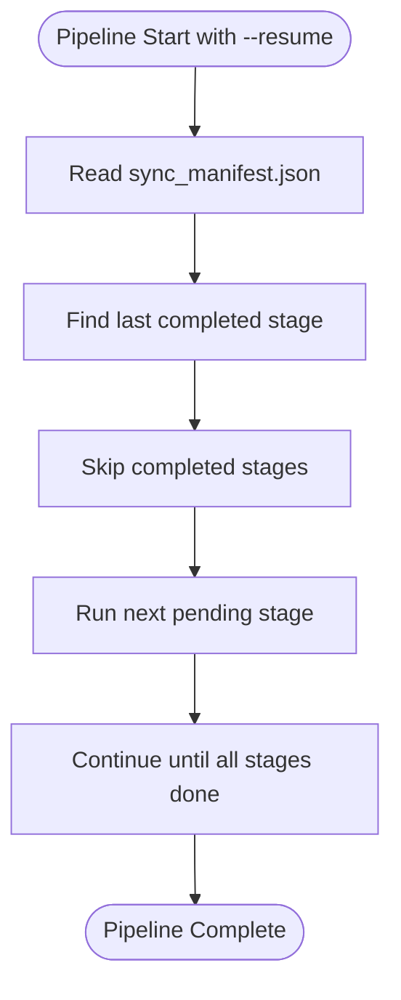

# Design Document: GBM Research Automation Pipeline

## Overview

This document describes the system design for the GBM research automation pipeline. The pipeline orchestrates five skill-based stages (literature survey, model training, visualization, paper writing, cloud sync) using a central Python orchestrator (`run_pipeline.py`) and a YAML configuration file (`pipeline_config.yaml`). Each stage is time-bounded to 90 minutes and writes its outputs to well-defined locations so that any stage can be re-run independently.

---

## Architecture Design

### System Architecture Diagram



### Data Flow Diagram



---

## Component Design

### `run_pipeline.py` — Orchestrator

- **Responsibilities**: Parse `pipeline_config.yaml`, verify input files, run each stage in order with a per-stage timeout, update `sync_manifest.json`, trigger cloud sync.
- **Interfaces**:
  - `verify_input_files(config) -> None` — raises `FileNotFoundError` listing missing files
  - `run_stage(name, fn, timeout_minutes) -> dict` — executes `fn()` in a subprocess with timeout; returns `{"status": "ok"|"timeout"|"error", "outputs": [...], "elapsed": float}`
  - `update_manifest(entry: dict) -> None` — appends to `results/sync_manifest.json`
  - `cloud_sync(manifest_path, config) -> None` — uploads files to cloud target with retry logic
- **Dependencies**: `pipeline_config.yaml`, `results/` directory

### `pipeline_config.yaml` — Configuration

- **Responsibilities**: Single source of truth for all paths, timeouts, figure specs, and cloud settings.
- **Key sections**: `pipeline`, `data`, `figures`, `cloud`, `skills`
- **Dependencies**: None (consumed by orchestrator at startup)

### autoresearch Stage (S1–S5)

- **Responsibilities**: Literature survey, related-work retrieval, hypothesis framing, writing `sections/introduction.tex` and populating `references.bib`.
- **Interfaces**: Called via `skills.autoresearch_cmd` from config with `--tasks S1-S5` argument.
- **Dependencies**: Internet access, `data.ref_folder`, output directory

### Model Training Stage (S6)

- **Responsibilities**: Load CPTAC and TCGA cohorts, run classical and deep model benchmark, write `results/metrics.json`.
- **Interfaces**: Standalone Python module; invoked as subprocess.
- **Dependencies**: `data.cptac_path`, `data.tcga_path`, `data.scrna_path`

### academic-plotting Stage (S7–S8)

- **Responsibilities**: Generate all publication figures (UMAP, heatmaps, ROC, Kaplan–Meier, etc.) from metrics and intermediate model outputs.
- **Interfaces**: Called via `skills.plotting_cmd` with `--config pipeline_config.yaml`.
- **Dependencies**: `results/metrics.json`, `figures/` output directory, `matplotlib`, `seaborn`, `scanpy`

### ml-paper-writing + humanizer Stage (S9)

- **Responsibilities**: Populate LaTeX section templates with research content; then apply humanizer post-processing to reduce AI-detectable text patterns.
- **Interfaces**:
  - Called via `skills.paper_writing_cmd`
  - Humanizer called via `skills.humanizer_cmd` on each generated `.tex` file
- **Dependencies**: All prior stages complete, `sections/` templates

### Cloud Sync

- **Responsibilities**: Upload all outputs listed in `results/sync_manifest.json` to the remote target, with retry logic.
- **Interfaces**: `cloud_sync(manifest_path, config)` in orchestrator.
- **Dependencies**: `cloud.enabled`, `cloud.remote_target`, `cloud.retry_attempts`, `cloud.retry_delay_seconds`

---

## Data Model

```python
# Sync Manifest entry (appended to results/sync_manifest.json as JSON Lines)
class ManifestEntry(TypedDict):
    stage: str          # e.g. "autoresearch", "plotting", "paper_writing"
    output_path: str    # relative path from repo root
    timestamp: str      # ISO-8601 UTC
    status: str         # "ok" | "timeout" | "error"

# Stage result returned by run_stage()
class StageResult(TypedDict):
    status: str         # "ok" | "timeout" | "error"
    outputs: list[str]  # list of output file paths produced
    elapsed: float      # wall-clock seconds
    error: str | None   # error message if status != "ok"
```

---

## Business Process

### Process 1: Full Pipeline Run



### Process 2: Resume from Failed Stage



---

## Error Handling Strategy

| Error Type | Handling |
|---|---|
| Missing input file | `verify_input_files()` raises `FileNotFoundError` with list of missing paths; pipeline aborts |
| Stage timeout | Log `TIMEOUT` to manifest, skip stage, continue with remaining stages |
| Stage runtime error | Log `ERROR` + traceback to manifest, skip stage, continue |
| Cloud sync failure | Retry up to `cloud.retry_attempts` times; log warning if all retries exhausted |
| LaTeX compilation error | Log error; `main.pdf` not produced; other outputs still synced |
