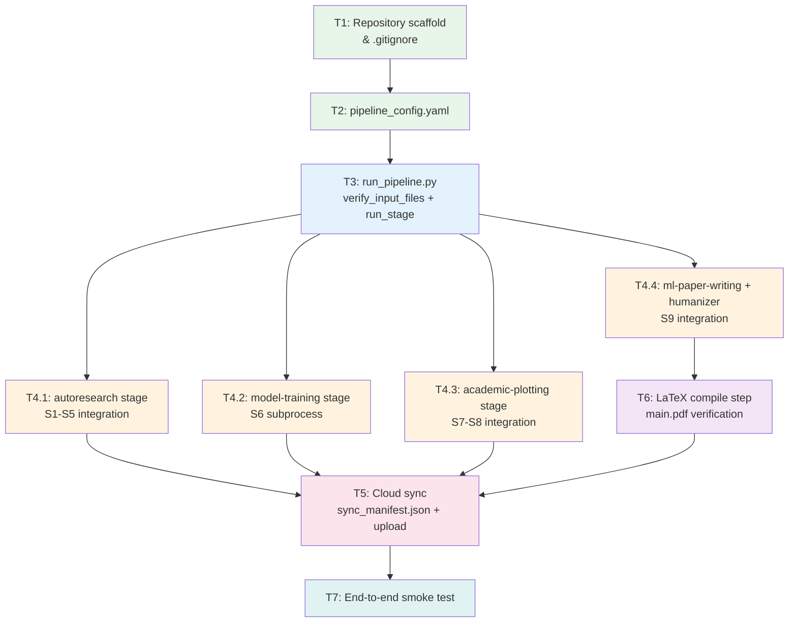

# Tasks: GBM Research Automation Pipeline

## Task Dependency Diagram

---

## Task List

### T1 — Repository Scaffold & `.gitignore`

- [x] Create `.claude/specs/gbm-research-automation/` directory
- [x] Create `requirements.md` (this set of spec documents)
- [x] Create `design.md`
- [x] Create `tasks.md` (this file)
- [x] Add `.gitignore` to exclude LaTeX build artifacts (`*.aux`, `*.log`, `*.bbl`, `*.blg`, `*.out`) and data files

### T2 — `pipeline_config.yaml`

- [x] Define `pipeline` section: `max_runtime_minutes`, `overwrite_figures`, `resume`
- [x] Define `data` section: `cptac_path`, `tcga_path`, `scrna_path`, `ref_folder`, `output_dir`
- [x] Define `figures` section: list of figure specs (name, script, output paths)
- [x] Define `cloud` section: `enabled`, `remote_target`, `retry_attempts`, `retry_delay_seconds`
- [x] Define `skills` section: command templates for each skill

### T3 — `run_pipeline.py` Core Orchestrator

- [x] Implement `load_config(path)` — parse YAML, validate required keys
- [x] Implement `verify_input_files(config)` — check all `data.*` paths exist, raise `FileNotFoundError` if not
- [x] Implement `run_stage(name, cmd, timeout_minutes)` — subprocess with timeout, capture stdout/stderr
- [x] Implement `update_manifest(entry, manifest_path)` — append JSON line to `results/sync_manifest.json`
- [x] Implement `main()` — orchestrate T4.1–T4.4, T5, T6 in order; support `--resume` flag

### T4.1 — autoresearch Stage (S1–S5)

- [x] Build CLI command from `skills.autoresearch_cmd` in config
- [x] Pass `--tasks S1 S2 S3 S4 S5` and `--output-dir` arguments
- [x] On completion, verify `sections/introduction.tex` and `references.bib` exist
- [x] Log outputs to manifest

### T4.2 — Model Training Stage (S6)

- [x] Build CLI command for model training subprocess
- [x] Pass CPTAC and TCGA paths from config
- [x] On completion, verify `results/metrics.json` exists
- [x] Log outputs to manifest

### T4.3 — academic-plotting Stage (S7–S8)

- [x] Build CLI command from `skills.plotting_cmd` in config
- [x] Skip figures that already exist when `overwrite_figures: false`
- [x] On completion, verify all expected `.pdf` and `.png` files exist in `figures/`
- [x] Log outputs to manifest

### T4.4 — ml-paper-writing + humanizer Stage (S9)

- [x] Build CLI command from `skills.paper_writing_cmd` in config
- [x] After paper writing completes, run `skills.humanizer_cmd` on each generated `.tex` file
- [x] On completion, verify `sections/*.tex` files are non-empty
- [x] Log outputs to manifest

### T5 — Cloud Sync

- [x] Read all entries from `results/sync_manifest.json`
- [x] If `cloud.enabled` is `true`, upload each output file to `cloud.remote_target`
- [x] Retry on failure up to `cloud.retry_attempts` times
- [x] Update `status` field in manifest to `"done"` when all uploads succeed

### T6 — LaTeX Compile Step

- [x] Run `pdflatex` + `bibtex` + `pdflatex` × 2 on `main.tex`
- [x] Verify `main.pdf` is produced
- [x] Log PDF path to manifest

### T7 — End-to-End Smoke Test

- [x] Run `python run_pipeline.py --dry-run` to verify config loading and input-file checks without executing long-running stages
- [x] Assert exit code 0 and presence of `results/sync_manifest.json`
