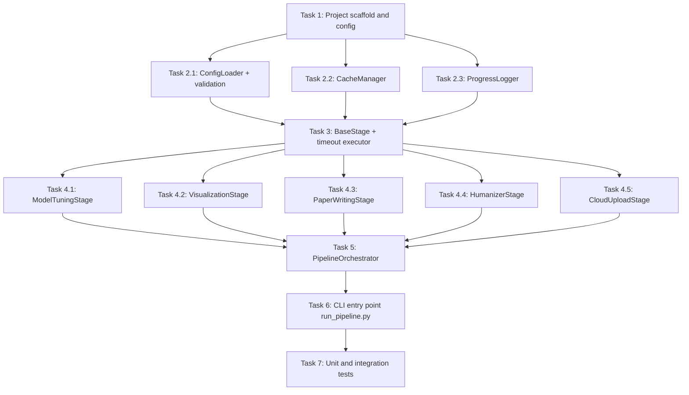

# Tasks Document

## Dependency Diagram

---

## Task List

- [x] **Task 1 — Project scaffold and configuration template**
  - Create `pipeline_config.yaml` at the repository root with all required sections: `data_paths`, `outputs_dir`, `figures_dir`, `sections_dir`, `timeout_seconds` (default 5400), `cloud`, and `skills`.
  - Create `pipeline/` Python package directory with `__init__.py`.
  - Add `outputs/` and `outputs/humanized/` to `.gitignore`.
  - Refs: Requirement 7 (all acceptance criteria)

- [x] **Task 2.1 — `ConfigLoader` with validation**
  - Implement `pipeline/config.py` containing `ConfigLoader` class.
  - `__init__` reads and parses YAML from the given path; resolves relative paths against the repository root.
  - `validate()` checks all required top-level keys and raises `ConfigError` with the missing key name.
  - `get(key)` supports dot-notation for nested access (e.g. `"cloud.destination"`).
  - Refs: Requirement 7.1, 7.2, 7.3, 7.4

- [x] **Task 2.2 — `CacheManager`**
  - Implement `pipeline/cache.py` containing `CacheManager` class.
  - Stores SHA-256 checksums of input file sets in `.pipeline_cache.json` at the repository root.
  - `check_inputs(stage_name, paths)` returns `True` if all checksums match cached values (skip-eligible).
  - `record_outputs(stage_name, paths)` updates cached checksums after a successful stage run.
  - Refs: Requirement 2.4, 3.4

- [x] **Task 2.3 — `ProgressLogger`**
  - Implement `pipeline/logger.py` containing `ProgressLogger` class.
  - Writes newline-delimited JSON records to `pipeline.log` with fields: `timestamp`, `stage`, `status`, `elapsed_seconds`, `message`.
  - Exposes `log(result: StageResult)` and `log_message(stage, level, message)` methods.
  - Refs: Requirement 1.3

- [x] **Task 3 — `BaseStage` and timeout executor**
  - Implement `pipeline/base.py` containing `StageStatus`, `StageResult`, and `BaseStage`.
  - `BaseStage.run_with_timeout(fn, timeout)` uses `concurrent.futures.ProcessPoolExecutor` with a `TIMEOUT_SECONDS` deadline; returns `StageResult` with `status=TIMEOUT` if exceeded.
  - `BaseStage.should_skip(config, cache)` delegates to `CacheManager.check_inputs`.
  - Refs: Requirement 1.2

- [x] **Task 4.1 — `ModelTuningStage`**
  - Implement `pipeline/stages/model_tuning.py`.
  - Builds the `autoresearch` skill CLI command from `config.get("skills.autoresearch")` and `config.get("data_paths")`.
  - Runs the command as a subprocess; streams stdout/stderr to the logger.
  - On completion, writes `outputs/model_tuning/results_summary.json` with best AUC and C-index per model.
  - If `outputs/model_tuning/results_summary.json` exists and `--force` is not set, delegates to `CacheManager` to skip.
  - Refs: Requirement 2.1, 2.2, 2.3, 2.4

- [x] **Task 4.2 — `VisualizationStage`**
  - Implement `pipeline/stages/visualization.py`.
  - Builds the `academic-plotting` skill CLI command from `config.get("skills.academic_plotting")`.
  - Asserts that each required figure file (`fig_umap_patients`, `fig_kaplan_meier`, `fig_v7_external_roc`, `fig_v7_ablation_auc`, `fig_volcano`) is present in `figures/` after the skill completes.
  - Saves both `.pdf` and `.png` for each figure.
  - Uses `CacheManager` for incremental skip.
  - Refs: Requirement 3.1, 3.2, 3.3, 3.4

- [x] **Task 4.3 — `PaperWritingStage`**
  - Implement `pipeline/stages/paper_writing.py`.
  - Builds the `ml-paper-writing` skill CLI command from `config.get("skills.ml_paper_writing")`.
  - Passes `outputs/model_tuning/results_summary.json` and `figures/` as inputs to the skill.
  - After the skill completes, replaces `% AUTO-GENERATED ... % END AUTO-GENERATED` blocks in each `sections/*.tex` file with the new content; leaves surrounding content intact.
  - Refs: Requirement 4.1, 4.2, 4.3, 4.4

- [x] **Task 4.4 — `HumanizerStage`**
  - Implement `pipeline/stages/humanizer.py`.
  - Builds the `humanizer` skill CLI command from `config.get("skills.humanizer")`.
  - Processes each file in `sections/`; writes output to `outputs/humanized/<section>.tex`.
  - Generates `outputs/humanized/changes.diff` using Python's `difflib.unified_diff`.
  - If a humanized output is empty, logs a warning and copies the original.
  - Refs: Requirement 5.1, 5.2, 5.3, 5.4

- [x] **Task 4.5 — `CloudUploadStage`**
  - Implement `pipeline/stages/cloud_upload.py`.
  - Reads `config.get("cloud.destination")` and `config.get("cloud.tool")` (e.g. `"rclone"`, `"aws s3"`, `"gsutil"`).
  - Uploads `outputs/` and `figures/` recursively.
  - On network failure, retries with exponential back-off: delays of 60, 120, 240, 480, 600 seconds (max 5 retries).
  - On success, writes `outputs/upload_manifest.json` with file paths and SHA-256 checksums.
  - Refs: Requirement 6.1, 6.2, 6.3, 6.4

- [x] **Task 5 — `PipelineOrchestrator`**
  - Implement `pipeline/orchestrator.py` containing `PipelineOrchestrator`.
  - `run(stages=None)` iterates over the ordered stage list (or a user-specified subset); instantiates and invokes each stage; collects `StageResult` objects; passes each to `ProgressLogger`.
  - Returns exit code `0` if all stages completed or were skipped; `1` if any stage failed or timed out.
  - Refs: Requirement 1.1, 1.2, 1.3

- [x] **Task 6 — CLI entry point `run_pipeline.py`**
  - Implement `run_pipeline.py` at the repository root.
  - Accepts `--config <path>`, `--force`, `--stages <stage1,stage2,...>`, and `--help`.
  - Instantiates `ConfigLoader`, calls `validate()`, then hands off to `PipelineOrchestrator.run()`.
  - Prints a human-readable summary table of stage results on exit.
  - Refs: Requirement 1.1, 7.4

- [ ] **Task 7 — Unit and integration tests**
  - Create `tests/` directory with `test_config.py`, `test_cache.py`, `test_logger.py`, `test_orchestrator.py`.
  - `test_config.py`: test that `validate()` raises `ConfigError` for each missing required key.
  - `test_cache.py`: test that `check_inputs` returns `True` on unchanged files and `False` after modification.
  - `test_logger.py`: test that `log()` writes valid JSON records to `pipeline.log`.
  - `test_orchestrator.py`: integration smoke test using stub stages (fast stubs, no real skill CLIs); assert all results are `COMPLETED`.
  - Timeout test: stub stage that sleeps 10 s with `TIMEOUT_SECONDS=2`; assert result is `TIMEOUT`.
  - Refs: All requirements
